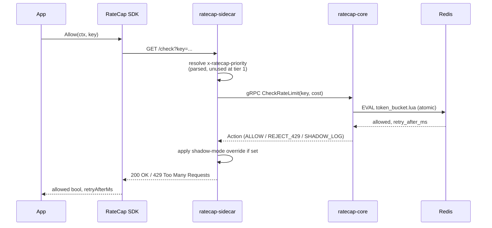
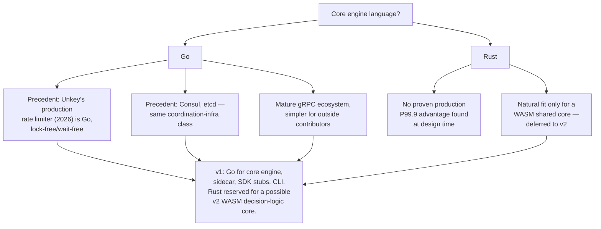
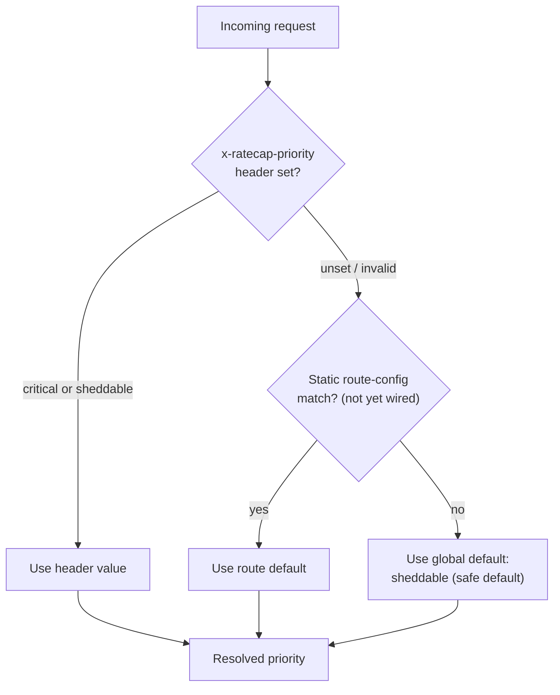

# Thinking Diagrams

Visual companion to [`ARCHITECTURE.md`](ARCHITECTURE.md) and the [design spec](docs/superpowers/specs/2026-07-13-ratecap-v1-design.md). These diagrams render natively on GitHub (Mermaid).

## 1. Request flow (Tier 1)



## 2. Component architecture

```mermaid
flowchart TB
    App["App (any language)"] -->|"in-process call"| SDK["RateCap SDK<br/>(thin gRPC/HTTP client)"]
    SDK -->|"localhost, ~0.1-0.5ms"| Sidecar["ratecap-sidecar<br/>(local, per-host)"]
    Sidecar -->|"gRPC, cache-miss/sync only"| Core["ratecap-core<br/>(central engine)"]
    Core -->|"Lua scripts, atomic"| Redis[("Redis")]

    subgraph Core Interfaces
        Limiter["Limiter interface<br/>(TokenBucketLimiter today)"]
        StateStore["StateStore interface<br/>(RedisStore today)"]
        Limiter --> StateStore
    end

    Core --- Limiter

## 3. Key decision: SDK distribution strategy

Three options were weighed during brainstorming for how limiter logic reaches every language's SDK. Sidecar/RPC-only was chosen — see [design spec, "Key architectural decisions"](docs/superpowers/specs/2026-07-13-ratecap-v1-design.md).

```mermaid
flowchart LR
    subgraph A["Option A: WASM shared core (deferred to v2)"]
        A1["App"] -->|"in-process, no network hop"| A2["WASM module<br/>(compiled from Rust)"]
        A2 -.->|"unproven in production<br/>at design time"| A3["core engine<br/>(shared state only)"]
    end

    subgraph B["Option B: Sidecar / RPC-only (chosen for v1)"]
        B1["App"] --> B2["SDK (thin stub)"]
        B2 -->|"gRPC/HTTP"| B3["sidecar"]
        B3 -->|"gRPC"| B4["core engine<br/>(all decision logic)"]
    end

    subgraph C["Option C: Independent per-language reimplementation"]
        C1["Go SDK<br/>(own token bucket)"]
        C2["Python SDK<br/>(own token bucket)"]
        C3["Node SDK<br/>(own token bucket)"]
        C4["core engine<br/>(shared state only)"]
        C1 -.->|"drift risk"| C4
        C2 -.->|"drift risk"| C4
        C3 -.->|"drift risk"| C4
    end
```

**Why B:** no per-language reimplementation to keep behaviorally identical (the drift risk Bucket4j/Guava/resilience4j each accept independently), and no bet on an unproven WASM-in-production pattern for v1. The `Limiter` interface in `ratecap-core` stays swappable, so Option A can be revisited for v2 without a rewrite.

## 4. Key decision: Go vs. Rust for the core engine



## 5. Key decision: priority resolution order

Tier 1 doesn't use priority — only Tier 3 (fleet-usage shedder, not yet built) will. The resolution mechanism is scaffolded now so Tier 3 only has to wire in real branching logic, not design the fallback chain.


